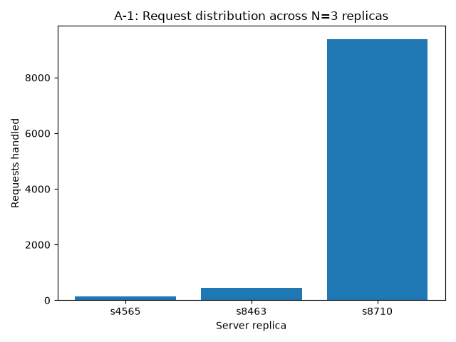
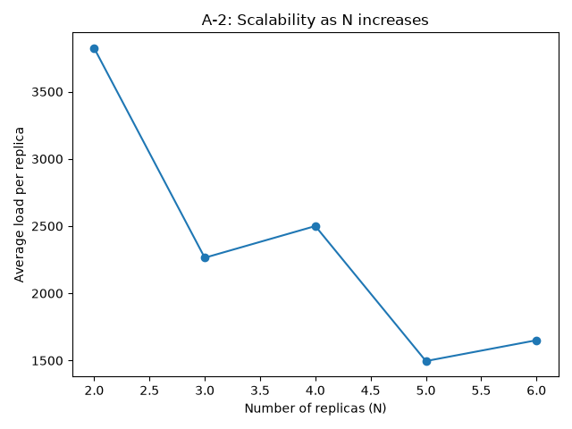
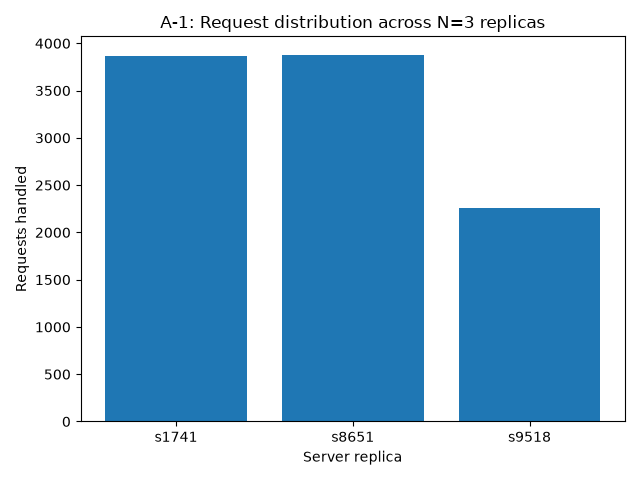
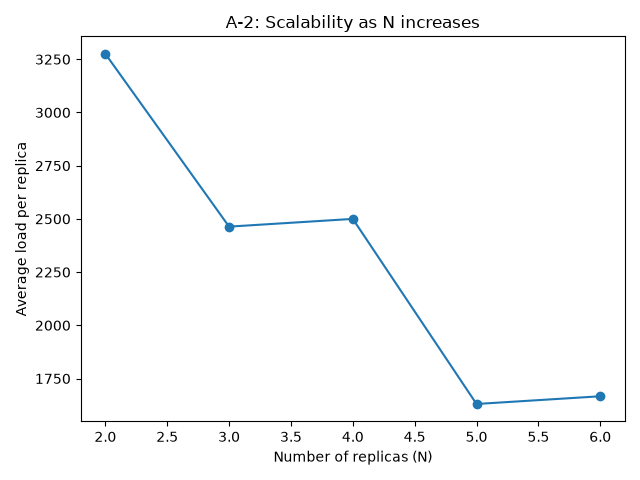

# Customizable Load Balancer

**ICS 4104: Distributed Systems — Assignment 1**

## Overview

This project implements a load balancer that distributes client requests across a
scalable, self-healing pool of backend server replicas using **consistent hashing**.
It fulfils the four tasks in `docs/DS_Assign_LB_2024.pdf`:

| Task | What it does | Where |
|---|---|---|
| Task 1 — Server | Minimal Flask web server exposing `/home` and `/heartbeat` | `server/server.py` |
| Task 2 — Consistent Hashing | Circular hash map with quadratic probing + virtual servers | `loadbalancer_service/consistent_hash.py` |
| Task 3 — Load Balancer | Routes requests, manages replica set, spawns/removes containers | `loadbalancer_service/app.py` |
| Task 4 — Analysis | Async load generator + bar/line chart plots | `analysis/analyze.py` |

Everything runs in Docker containers on a shared bridge network (`net1`); only the
load balancer's port 5000 is published to the host, matching the assignment's system
diagram — clients never talk to a server replica directly.

## Design choices & assumptions

- **Language:** Python 3 + Flask, per the assignment's stated preference.
- **Consistent hash parameters** (as specified): `N = 3` server containers,
  `#slots = 512`, `K = log2(512) = 9` virtual servers per container,
  `H(i) = i² + 2i + 17`, `Φ(i, j) = i² + j² + 2j + 25`.
- **Collision handling:** quadratic probing when placing a (virtual) server on an
  occupied slot; request routing walks clockwise (linear scan) from `H(request_id)`
  to the nearest occupied slot, per the spec.
- **Replica naming:** the spec's examples use human-readable names like `"Server 1"`;
  since these also have to be valid Docker container hostnames (no spaces), replicas
  are named `sNNNN` (randomly generated) unless a caller supplies its own hostname
  via `/add`, for both the initial bootstrap and later scale-ups.
- **Spawning containers:** the load balancer container is run with
  `-v /var/run/docker.sock:/var/run/docker.sock` and `privileged: true` so it can use
  the host's Docker daemon to start/stop sibling containers, per Appendix C of the
  assignment.
- **Failure recovery:** a daemon thread (`heartbeat_monitor` in `app.py`) polls every
  replica's `/heartbeat` every `LB_HEARTBEAT_INTERVAL` seconds (default 2s, `LB_HEARTBEAT_TIMEOUT`
  default 2s). Any replica that fails to respond is deregistered from the hash ring and
  immediately replaced with a freshly spawned instance, keeping the replica count at N
  as required by the assignment ("There should always be N servers present...").
- **Request IDs:** since clients don't supply one, the load balancer generates a
  random 6-digit id per incoming request before hashing it with `H(i)`.

## Repository layout

```
loadbalancer/
├── server/                   # Task 1: backend replica image
│   ├── server.py
│   ├── requirements.txt
│   └── Dockerfile
├── loadbalancer_service/      # Task 2 + Task 3: the load balancer image
│   ├── consistent_hash.py
│   ├── app.py
│   ├── requirements.txt
│   └── Dockerfile
├── analysis/                 # Task 4: performance analysis
│   ├── analyze.py
│   └── results/              # generated charts land here (git-ignored except .gitkeep)
├── tests/                    # unit tests (see Testing below)
├── docker-compose.yml
├── Makefile
├── requirements-dev.txt
└── pytest.ini
```

## Dependencies

- Docker Engine ≥ 20.10 and the Docker Compose plugin (`docker compose`)
- Python 3.9+ (only needed on the host to run `analysis/analyze.py` and the test suite —
  the containers bring their own Python)
- `pip install -r requirements-dev.txt` for running tests/analysis locally

## Installation & usage

```bash
git clone <this-repo-url>
cd loadbalancer

# Build both images and start the load balancer (it bootstraps 3 replicas itself)
make up

# Check the replica set
curl http://localhost:5000/rep

# Scale up: add 2 more replicas, one with a chosen hostname
curl -X POST http://localhost:5000/add \
  -H "Content-Type: application/json" \
  -d '{"n": 2, "hostnames": ["s_custom"]}'

# Scale down: remove 1 replica
curl -X DELETE http://localhost:5000/rm \
  -H "Content-Type: application/json" \
  -d '{"n": 1, "hostnames": []}'

# Route a request through the load balancer to whichever replica owns it
curl http://localhost:5000/home

# Stop everything (including replicas the load balancer spawned)
make down
```

Equivalent raw `docker` / `docker compose` commands (what `make up`/`make down` wrap):

```bash
docker build -t loadbalancer-server:latest ./server
docker compose build
docker compose up -d
docker compose logs -f loadbalancer
docker compose down
```

### Endpoints (load balancer, port 5000)

| Method | Path | Purpose |
|---|---|---|
| GET | `/rep` | Current replica count + hostnames |
| POST | `/add` | `{"n": <int>, "hostnames": [...]}` — scale up |
| DELETE | `/rm` | `{"n": <int>, "hostnames": [...]}` — scale down |
| GET | `/<path>` | Routed to a replica via consistent hashing (e.g. `/home`) |

## Running on Windows (Docker Desktop + a venv)

This is the exact setup and command sequence used to build, run, and verify every
task in this project — no WSL required. `make` isn't native to PowerShell, so every
step below uses the raw `docker` / `docker compose` / `python` commands it wraps.
All commands are PowerShell; `curl` works as-is on Windows 10/11 (it's the real
`curl.exe`, not an alias) — if yours resolves to `Invoke-WebRequest` instead, swap
in `Invoke-RestMethod` (shown as an alternative on the first request).

### 0. Prerequisites

- **Docker Desktop for Windows**, installed and running. The WSL2 backend (the
  default) is fine — you still type commands into a normal PowerShell window, never
  a WSL shell. Confirm it's actually up before continuing:
  ```powershell
  docker version
  docker compose version
  ```
  If `docker version` fails to reach the daemon, start Docker Desktop (from the
  Start menu, or `Start-Process "$env:ProgramFiles\Docker\Docker\Docker Desktop.exe"`)
  and wait ~30-60s for it to finish booting before retrying.
- **Python 3.9+** for the venv. Verify `python` on your `PATH` is a real CPython
  install, not some other application's bundled interpreter (a known trap — e.g.
  Inkscape ships one): `python -m venv .venv` should create a `.venv\Scripts\`
  folder. If you get `.venv\bin\` instead, find the real interpreter (e.g.
  `Get-Command python -All`, or `$env:LOCALAPPDATA\Microsoft\WindowsApps\python3.exe`
  for the Microsoft Store build) and use its full path in the next step instead of
  bare `python`.

### 1. One-time setup: venv + dependencies

```powershell
cd loadbalancer
python -m venv .venv
.\.venv\Scripts\python.exe -m pip install --upgrade pip
.\.venv\Scripts\python.exe -m pip install -r requirements-dev.txt aiohttp matplotlib
```

### 2. Task 1 & 2 — run the unit test suite (no Docker needed)

```powershell
.\.venv\Scripts\python.exe -m pytest -v
```
Expect `28 passed` — covers the consistent hash formulas/virtual-server placement/
quadratic probing (Task 2), the `/home` & `/heartbeat` routes (Task 1), and the load
balancer's endpoints + failure-monitor logic (Task 3) with Docker calls stubbed out.

### 3. Build the images

```powershell
docker build -t loadbalancer-server:latest .\server
docker compose build
docker images | Select-String "loadbalancer"
```

### 4. Task 3 — start the stack and exercise every endpoint

```powershell
docker compose up -d
docker compose ps                 # "lb" container, port 5000 published
docker ps --filter "ancestor=loadbalancer-server:latest"   # 3 bootstrapped replicas
```

`/rep` — current replica set:
```powershell
curl http://localhost:5000/rep
# or: Invoke-RestMethod http://localhost:5000/rep | ConvertTo-Json
```

`/home` routed through the ring to whichever replica owns it:
```powershell
curl http://localhost:5000/home
```

`/add` — scale up (2 more replicas, one with a chosen hostname):
```powershell
curl -X POST http://localhost:5000/add `
  -H "Content-Type: application/json" `
  -d '{"n": 2, "hostnames": ["s_custom"]}'
```

`/add` sanity check — hostname list longer than `n` must 400:
```powershell
curl -X POST http://localhost:5000/add `
  -H "Content-Type: application/json" `
  -d '{"n": 1, "hostnames": ["a","b"]}'
```

`/rm` — scale down (remove `s_custom` plus one more):
```powershell
curl -X DELETE http://localhost:5000/rm `
  -H "Content-Type: application/json" `
  -d '{"n": 2, "hostnames": ["s_custom"]}'
```

Unregistered path — must return the spec's JSON `400`, not a raw 404 page:
```powershell
curl -v http://localhost:5000/other
```

### 5. Task 3 — verify automatic failure recovery (A-3)

```powershell
curl http://localhost:5000/rep                      # note one hostname, e.g. "s7045"
docker kill s7045                                    # simulate a crashed replica
# poll a few times a second apart:
curl http://localhost:5000/rep
curl http://localhost:5000/rep
```
Within a couple of seconds `N` stays at 3 and `s7045` is replaced by a freshly
spawned hostname — no `/add` call needed, the load balancer's background heartbeat
monitor does this on its own (`LB_HEARTBEAT_INTERVAL`/`LB_HEARTBEAT_TIMEOUT`, 2s
default each).

### 6. Task 4 — performance analysis (A-1, A-2)

Reset to a clean N=3 baseline first if you scaled the ring around in step 4/5:
```powershell
docker compose down
docker ps -aq --filter "ancestor=loadbalancer-server:latest" | ForEach-Object { docker rm -f $_ }
docker compose up -d
Start-Sleep -Seconds 3
curl http://localhost:5000/rep
```

Run the analysis (fires 10,000 requests for A-1 at N=3, then scales N from 2→6 and
fires 10,000 more at each step for A-2):
```powershell
.\.venv\Scripts\python.exe analysis\analyze.py --requests 10000
```
Charts land in `analysis\results\a1_bar_chart.png` and `a2_line_chart.png`. See the
[Performance analysis](#performance-analysis-task-4) section below for the actual
results and what they show.

### 7. Task 4 — A-4: try a different hash function

```powershell
# 1. Edit loadbalancer_service\consistent_hash.py: change request_hash / virtual_server_hash
# 2. Rebuild just the load balancer image (server image is untouched):
docker compose build loadbalancer
# 3. Redeploy with a clean replica set:
docker compose down
docker ps -aq --filter "ancestor=loadbalancer-server:latest" | ForEach-Object { docker rm -f $_ }
docker compose up -d
Start-Sleep -Seconds 3
# 4. Re-run the analysis against the modified hash:
.\.venv\Scripts\python.exe analysis\analyze.py --requests 10000
# 5. Rename the outputs so they don't overwrite your A-1/A-2 charts:
Move-Item analysis\results\a1_bar_chart.png analysis\results\a4_bar_chart_modified.png
Move-Item analysis\results\a2_line_chart.png analysis\results\a4_line_chart_modified.png
# 6. Revert consistent_hash.py back to the assignment's specified H(i)/Phi(i,j),
#    then rebuild + redeploy again (step 2-3) so the delivered stack matches Task 2's spec.
```

### 8. Tear down

```powershell
docker compose down
docker ps -aq --filter "ancestor=loadbalancer-server:latest" | ForEach-Object { docker rm -f $_ }
```

## Testing

Unit tests cover the consistent hash map (Task 2) and both Flask apps' routes
(Tasks 1 & 3), with Docker/network calls stubbed out via `pytest`'s `monkeypatch` —
**no Docker daemon or running stack is required** to run them:

```bash
cd loadbalancer
pip install -r requirements-dev.txt
pytest -v
# or: make test
```

What's covered (28 tests, all passing):
- `tests/test_consistent_hash.py` — hash formulas match the spec, virtual-server
  placement, quadratic-probing collision resolution, request routing, add/remove.
- `tests/test_server.py` — `/home` reports the configured `SERVER_ID`, `/heartbeat`
  returns 200.
- `tests/test_loadbalancer_endpoints.py` — `/rep`, `/add`, `/rm` validation and
  happy paths, and `/<path>` request forwarding/error handling, including a live
  server responding 404 (see bug fix below).
- `tests/test_heartbeat_monitor.py` — dead replicas get replaced while healthy ones
  are left alone, N stays constant across single and simultaneous failures.

We also ran the full stack end-to-end under Docker Desktop and exercised every
endpoint with `curl` beyond what the unit tests cover, which caught two real bugs
fixed before this was considered done:

- **`GET /<path>` was leaking raw HTML instead of the spec's JSON error.** The
  route only translated a *connection* failure (`requests.RequestException`) into
  the `"<Error> '/x' endpoint does not exist..."` response. A live backend that
  responds normally with its own 404 (e.g. Flask's default "Not Found" page for an
  unregistered route) sailed straight through as `upstream.content`/`upstream.status_code`.
  Confirmed live: `curl http://localhost:5000/other` returned the raw Flask 404 HTML
  with status 404 instead of the required JSON body with status 400. Fixed in
  `app.py`'s `route_request` by checking `upstream.status_code == 404` explicitly
  before passing the response through; covered by
  `test_route_request_unregistered_endpoint_returns_400`.
- **Both Flask apps ran single-threaded**, which serializes every concurrent client
  through one request at a time — directly contradicting the assignment's "routes
  requests asynchronously" requirement. This only became visible once we fired real
  concurrent load in Task 4 (see below): thousands of requests queued up and timed
  out. Fixed by adding `threaded=True` to both `app.run(...)` calls.

## Performance analysis (Task 4)

With the stack running (`make up`, or the Docker Desktop steps above), run:

```bash
make analyze
# or: python3 analysis/analyze.py --requests 10000
```

This fires 10,000 async requests at `/home` for **A-1** (bar chart of load per
replica at N=3) then scales N from 2 to 6 via `/add`/`/rm` and re-runs the load for
**A-2** (line chart of average load per replica as N grows). All results below are
from an actual run against the Dockerized stack (not simulated).

### A-1: Load distribution at N=3



```
s8710: 9389   s8463: 459   s4565: 152
```

**Observation:** with the assignment's mandated hash functions, load is **very
unevenly** distributed — one replica absorbed 94% of all 10,000 requests. This
traces back to a mathematical property of `H(i) = i² + 2i + 17 (mod 512)`: because
512 is a power of two (2⁹), `i² mod 512` depends only on `i mod 512`, and squaring
modulo a power of two is far from a bijection — the ~1,700 possible values of
`i mod 512` collapse onto a small cluster of quadratic residues instead of
spreading across all 512 slots. Almost every request hash lands in that cluster,
which happens to be closest (clockwise) to one particular server's virtual nodes.
Virtual servers (K=9) help smooth *server placement* on the ring, but they can't
fix a request hash that never explores most of the ring in the first place. This
is a property of the specified `H(i)`, not a bug in the routing/placement logic —
confirmed by A-4 below, where swapping in a better-mixing hash function alone
(same virtual-server code) fixes the skew.

### A-2: Scalability as N grows from 2 to 6



```
N=2: avg 3823.5   N=3: avg 2264.3   N=4: avg 2500.0   N=5: avg 1495.8   N=6: avg 1650.7
```

**Observation:** average load per replica trends down as N grows (more replicas
sharing the same 10,000 requests), which is the expected scaling direction, but
the line is **not smooth** — N=4's average is higher than N=3's. Because `H(i)`
concentrates almost all traffic onto whichever slot cluster happens to sit closest
to one lucky server, adding a replica can land it *outside* that hot cluster and
barely reduce the winner's share, or even leave the same server dominant. In other
words: with this hash function, scalability is unreliable — adding capacity
doesn't dependably redistribute load, because the request hash isn't exploring
the ring uniformly to begin with. A ring that actually spread requests over all
512 slots would show a much cleaner downward curve (see A-4).

### A-3: Failure recovery

Verified live against the running stack:

1. `curl http://localhost:5000/rep` → `{"N":3,"replicas":["s7045","s5183","s2735"]}`
2. `docker kill s7045` (simulating a crashed replica)
3. Polled `/rep` every second: within **~1 second** (`LB_HEARTBEAT_INTERVAL=2s`
   default, actual detection was faster than the full interval since the failed
   heartbeat was caught on the very next poll), the replica set became
   `["s5183","s2735","s3078"]` — `s7045` was gone and `s3078` had already been
   spawned and registered, with `N` unchanged at 3 throughout.
4. `curl http://localhost:5000/home` continued to succeed the entire time, routed
   to whichever surviving/new replica the ring picked.

All other endpoints were also exercised directly against the running containers:
`/rep`, `/add` (with and without hostnames, and the "hostnames longer than n"
400 case), `/rm` (same), and `/<path>` for both a valid path (`/home`) and an
invalid one (`/other`, which — after the bug fix described in Testing above —
correctly returns the spec's `400` JSON error instead of a raw 404 page).

### A-4: Modified hash functions

To test whether A-1/A-2's skew was caused by the specific hash formulas (not the
ring/virtual-server implementation), we temporarily swapped in a multiplicative
hash — `H(i) = 2654435761*i + 17 (mod 512)` and
`Φ(i,j) = 2654435761*i + 40503*j + 25 (mod 512)` — using an odd multiplier, which
makes `x ↦ a*x (mod 2ⁿ)` a bijection on the ring instead of the lossy squaring
above, rebuilt the load balancer image, and re-ran A-1/A-2 unchanged otherwise.



```
s1741: 3863   s8651: 3880   s9518: 2257   (vs. 9389 / 459 / 152 with the default hash)
```



```
N=2: avg 3275.5   N=3: avg 2463.7   N=4: avg 2500.0   N=5: avg 1630.4   N=6: avg 1666.7
```

**Observation:** the bar chart is far more even (2,257–3,880 vs. 152–9,389 — worst
case improved from a 62:1 spread to about 1.7:1), confirming the diagnosis: the
*mandated* `H(i)/Φ(i,j)` formulas are the cause of A-1/A-2's skew, not the ring or
virtual-server logic, which distributes fairly once given a hash that actually
explores the full slot space. The A-4 code change was reverted afterward — the
delivered code uses the assignment's specified `H(i)` and `Φ(i,j)` exactly, as
required by Task 2.

### A note on the testing environment

The bundled `analysis/analyze.py` fires all N requests concurrently via `aiohttp`.
On Windows, doing this against `localhost`/Docker Desktop's loopback NAT can throw
`OSError: [WinError 52]` ("duplicate name exists on the network") when thousands
of sockets open at once — a known Windows/aiohttp interaction, not a load balancer
bug. The script now sets `WindowsSelectorEventLoopPolicy`, bounds concurrency to
50 simultaneous connections (`LB_ANALYSIS_CONCURRENCY` env var), and retries a
dropped connection up to 3 times before giving up on it; the script prints how
many of the N requests were ultimately dropped/failed at the client for each run
so this is visible rather than silently skewing the counts.

## Deployment notes

- Everything is container-based; there is no separate "deployment" step beyond
  `make up` — the same command works for local development and grading.
- The load balancer needs access to the Docker socket to spawn replicas, so it
  cannot be deployed as an unprivileged/rootless container as-is (see
  `docker-compose.yml`).
- To point the load balancer at a different Docker network or backend image,
  override `LB_NETWORK` / `SERVER_IMAGE` / `LB_N` in `docker-compose.yml`'s
  `environment:` block before `make up`. `LB_HEARTBEAT_INTERVAL` /
  `LB_HEARTBEAT_TIMEOUT` tune how aggressively the failure monitor polls replicas.
